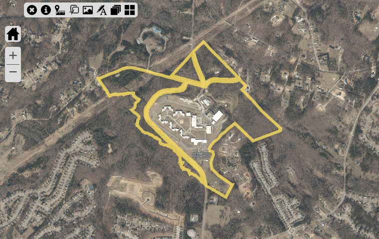
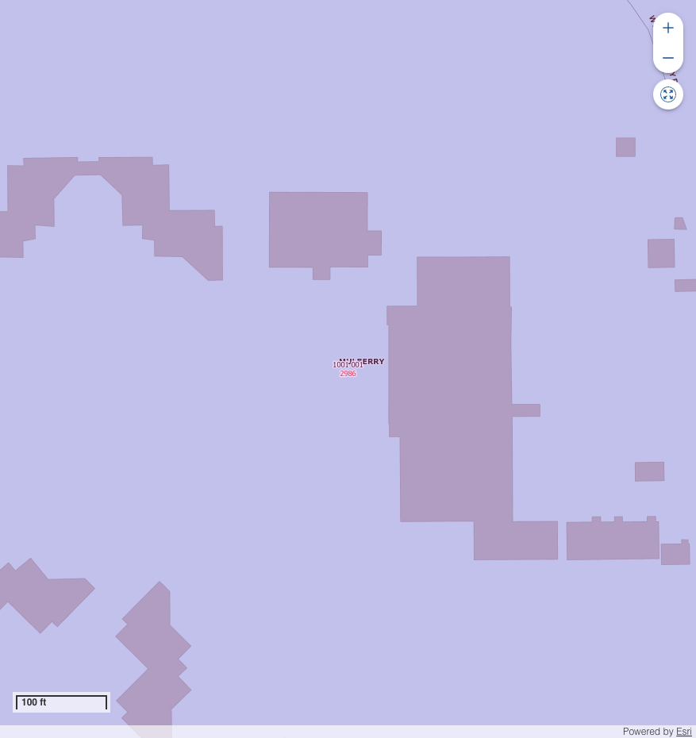

# Land Parcel Report - R1001001

## Overview

This document provides detailed information about the specified parcel of land, including its location, dimensions, zoning, and nearby points of interest.

---

## Parcel Details

| **Attribute**   | **Details**           |
|------------------|-----------------------|
| **PARCEL**    | R1001 001           |
| **OWNER**    | STATE OF GEORGIA           |
| **SITUSADDRESS**    | 2986 WEST ROCK QUARRY RD           |
| **TAXYEAR**    | 2024           |
| **TAX**    | 1258.32           |
| **PENALTY**    | 0.0           |
| **INTEREST**    | 47.31           |
| **FEE**    | 0.0           |
| **COST**    | 0.0           |
| **TOTALBALANCEDUE**    | 1305.63           |
| **Inst1DueDate**    | 2024-10-15 00:00:00           |
| **MAILINGADDRESS**    | 2986 W ROCK QUARRY RD           |
| **CITY**    | BUFORD           |
| **STATE**    | GA           |
| **ZIP**    | 30519-4117           |
| **ParcelData**    | {'Acres': '172.70', 'Land Value': '$50,748,700', 'Building Value': '$36,848,000', 'Total Fair Market Value': '$87,596,700'}           |
| **Acres**    | 172.7           |
| **Land Value**    | $50,748,700           |
| **Building Value**    | $36,848,000           |
| **Total Fair Market Value**    | $87,596,700           |
| **ACRES**    | 172.7           |

---

## Location Map

Below is the approximate location of the parcel:

---

## Land Use Information

### Zoning Regulations
The parcel is zoned ****, allowing for:

Restrictions:

### Utilities
- **Water Supply:** 
- **Electricity:** 
- **Sewer:** 

---

## Nearby Amenities

| **Amenity**        | **Distance** |
|--------------------|--------------|

---

## Photos

### Aerial View

### Vertigis View

### On-Ground View

---

## Contact Information

For inquiries or additional information, contact:

**Name:**   
**Phone:**   
**Email:**   

---

## AI Generated Notes

- Sure, let's analyze the area around the zip code 30519, specifically focusing on the amenities like K-12 schools, parks, and shopping centers. This zip code corresponds to an area in Buford, Georgia, which is part of Gwinnett County. Here are some insights about the amenities you might find in this area:

### Schools
1. **K-12 Education**: The Gwinnett County Public Schools are known for their quality education, and several well-regarded schools serve this area. Specifically, schools like Mill Creek High School, Fort Daniel Elementary School, and Jones Middle School are in proximity, offering strong academic programs and extracurricular activities.

2. **Private and Charter Schools**: In addition to public schools, there are several private and charter school options within a reasonable distance, catering to diverse educational needs and preferences.

### Parks and Recreation
1. **Bogan Park Community Recreation and Aquatic Center**: This popular facility offers a variety of recreational activities, including indoor pools, a gymnasium, and sports fields.

2. **Little Mulberry Park**: Located a short drive away, this park offers beautiful trails, fishing areas, and playgrounds, providing great opportunities for outdoor activities.

3. **Buford Dam Park**: Situated near Lake Lanier, this park provides picnic areas, walking trails, and beautiful views of the lake, making it a perfect spot for family outings.

### Shopping and Dining
1. **Mall of Georgia**: One of the largest malls in the Southeast, this shopping center offers a wide range of retail stores, restaurants, and entertainment options, including a cinema and numerous dining venues.

2. **Buford Corners Shopping Center and Marketplace at Millcreek**: These shopping centers offer additional retail and dining choices, ensuring that residents have access to a variety of goods and services.

3. **Local Dining**: The area features a diverse array of dining options, from casual eateries to more upscale restaurants, covering a wide range of cuisines.

### Transportation and Accessibility
1. **Proximity to Major Highways**: The area is conveniently located near Interstate 85 and State Route 20, providing easy access to downtown Atlanta and other nearby cities.

2. **Public Transportation**: While primarily a car-dependent area, Gwinnett County operates some bus services that connect Buford to other parts of the county.

### Real Estate Considerations
1. **Residential Options**: The area offers a mix of suburban neighborhoods with a range of housing styles and price points, suitable for families, young professionals, and retirees alike.

2. **Community Development**: As part of Gwinnett County’s ongoing development, the area continues to grow with new residential and commercial projects, enhancing its appeal to potential buyers.

These insights highlight some of the favorable attributes of living or investing in the parcel of land located in the 30519 zip code. It's an area rich in amenities that support a high quality of life, with ongoing development promising further enhancements.
