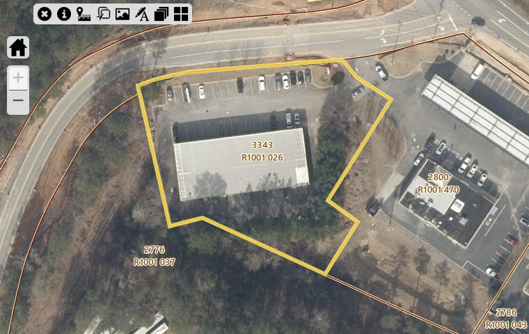

# Land Parcel Report - R1001026

## Overview

This document provides detailed information about the specified parcel of land, including its location, dimensions, zoning, and nearby points of interest.

---

## Parcel Details

| **Attribute**   | **Details**           |
|------------------|-----------------------|
| **PARCEL**    | R1001 026           |
| **OWNER**    | CHUNG MYUNG SOO           |
| **SITUSADDRESS**    | 3343 PUCKETTS MILL RD           |
| **TAXYEAR**    | 2024           |
| **TAX**    | 1332.83           |
| **PENALTY**    | 0.0           |
| **INTEREST**    | 0.0           |
| **FEE**    | 0.0           |
| **COST**    | 0.0           |
| **TOTALBALANCEDUE**    | 1332.83           |
| **Inst1DueDate**    | 2025-03-01 00:00:00           |
| **MAILINGADDRESS**    | 1664 MORNINGDALE CIR           |
| **CITY**    | DULUTH           |
| **STATE**    | GA           |
| **ZIP**    | 30097-5261           |
| **ParcelData**    | nan           |
| **Acres**    | 1.14           |
| **Land Value**    | $439,500           |
| **Building Value**    | $843,000           |
| **Total Fair Market Value**    | $1,282,500           |
| **ACRES**    | nan           |

---

## Location Map

Below is the approximate location of the parcel:

---

## Land Use Information

### Zoning Regulations
The parcel is zoned ****, allowing for:

Restrictions:

### Utilities
- **Water Supply:** 
- **Electricity:** 
- **Sewer:** 

## Photos

### Aerial View

### Vertigis View

### On-Ground View

---

## Contact Information

For inquiries or additional information, contact:

**Name:**   
**Phone:**   
**Email:**   

---

## AI Generated Notes

- ### Real Estate Insights for Parcel in Zip Code 30519-4117

#### Overview
The parcel of land located in zip code 30519-4117 offers a range of amenities that enhance its attractiveness for potential residential development. This area is situated in Gwinnett County, Georgia, which is known for its robust community services and family-friendly environment.

#### Education
- **K-12 Schools**: The local school district in this area is highly regarded for its comprehensive educational programs. The district includes top-rated schools such as:
  - **Mill Creek High School**: Known for its extensive Advanced Placement (AP) offerings and strong extracurricular activities.
  - **Frank N. Osborne Middle School**: Offers a variety of academic clubs and sports programs.
  - **Duncan Creek Elementary School**: Recognized for its focus on STEM education and strong parent-teacher community.

  Parents in the area can be confident in the quality of education their children will receive, which is a significant draw for families.

#### Parks and Recreation
- **Bogan Park**: Features a wide range of recreational facilities including swimming pools, sports fields, and walking trails. It's a perfect spot for family outings and community events.
- **Little Mulberry Park**: Offers expansive green spaces, hiking trails, and a lake for fishing and boating. It’s popular for both relaxing strolls and vigorous outdoor activities.
  
  The availability of well-maintained parks emphasizes the community’s commitment to promoting an active lifestyle and provides ample opportunities for outdoor recreation.

#### Shopping and Retail
- **Mall of Georgia**: One of the largest shopping centers in the Southeast, featuring a variety of retail stores, dining options, and entertainment venues, such as a movie theater and interactive activities.
- **Nearby Shopping Centers**: Include big-box retailers and local boutique stores that provide a diverse shopping experience.

  The proximity to these shopping destinations offers convenience and adds value to potential residential properties, appealing to those who appreciate accessibility to amenities.

#### Conclusion
The parcel of land in 30519-4117 is ideally located within reach of excellent educational institutions, abundant recreational opportunities, and convenient shopping centers. These features make it an attractive option for developers targeting families and individuals seeking a balance of suburban tranquility and urban convenience. The area's infrastructure and amenities significantly enhance its desirability, making it a promising investment for residential development.

- ### Real Estate Insights for Parcel of Land in Zip Code 30078-7774

#### Overview
Located in the vibrant area of Snellville, Georgia, the parcel of land in the 30078-7774 zip code offers substantial opportunities for development, whether residential or commercial. This area is characterized by strong community engagement and a balanced mix of suburban comfort and urban convenience.

#### Educational Amenities
1. **Highly Rated Schools**: The area is served by the Gwinnett County Public Schools system, known for its excellence. Nearby institutions include:
   - **South Gwinnett High School**: Offers a wide range of AP courses and extracurricular activities.
   - **Snellville Middle School**: Recognized for its strong academic programs and supportive learning environment.
   - **Norton Elementary School**: Known for its dedicated teaching staff and engaging curriculum.

2. **Private and Charter Schools**: Options such as Shiloh Hills Christian School provide alternatives to public schooling, catering to diverse educational needs and preferences.

#### Recreation and Parks
1. **Briscoe Park**: A short drive away, this park offers 87 acres of recreational activities, including walking trails, playgrounds, sports fields, and a lake for fishing.

2. **Lenora Park**: Features include a splash pad, multiple sports facilities, and a disc golf course, providing diverse options for outdoor activities.

3. **Community Events**: The area hosts various events, fostering a strong sense of community such as festivals, farmer's markets, and seasonal celebrations, leveraging the outdoor spaces effectively.

#### Shopping and Dining
1. **Snellville's Towne Center**: This area serves as a hub with various retail shops, restaurants, and service providers. Key tenants include big-box stores and boutique retailers, catering to a broad range of consumer needs.

2. **The Shoppes at Webb Gin**: Located within convenient proximity, this shopping center offers upscale retail options and a variety of dining establishments from casual eateries to fine dining, enhancing the living experience in the area.

3. **Dining Scene**: The culinary variety ranges from southern comfort food to international cuisines, reflecting Snellville's diverse cultural backdrop.

#### Transportation and Accessibility
- **Access To Major Highways**: Convenient access to major thoroughfares like U.S. Route 78 and Ronald Reagan Parkway ensures easy commutes to downtown Atlanta and other parts of the greater metro area.
- **Public Transit Options**: The area is served by Gwinnett County Transit, providing accessible public transportation options for residents and visitors alike.

#### Market Potential
1. **Growing Demand**: The proximity to high-quality amenities makes this area attractive for families, young professionals, and retirees, indicating strong future demand.
2. **Real Estate Trends**: Positive trends suggest a steady appreciation in property values, supported by consistent community development efforts and infrastructure improvements.

#### Conclusion
This parcel of land in the 30078-7774 zip code represents a promising opportunity for developers and investors, given its strategic location and the array of amenities supporting a high quality of life. Potential buyers and developers can expect a synergistic blend of educational, recreational, and commercial facilities that cater to modern living demands.

- **Real Estate Insights for Parcel in ZIP Code 30097-5261**

**Location Overview:**
The parcel of land located in ZIP code 30097-5261 is part of a vibrant community in Johns Creek, Georgia. This area is renowned for its beautiful suburban setting, excellent amenities, and high quality of life, making it a desirable location for families and individuals alike.

**Educational Amenities:**
The area is served by some of the top-rated schools in the state of Georgia, providing an excellent education system for families:

1. **Northview High School**: Known for its academic excellence, Northview High School consistently ranks among the top high schools in Georgia, offering a robust curriculum and numerous extracurricular activities.
   
2. **River Trail Middle School**: This school is recognized for a strong focus on STEM education and offers a supportive environment for adolescent learning and development.

3. **Shakerag Elementary School**: With a commitment to fostering early learning and development, this elementary school is well-rated and offers a wide range of programs to nurture young students.

**Recreational Amenities:**
Residents in this area have access to a variety of parks and recreational facilities, suitable for both relaxation and active lifestyles:

1. **Newtown Park**: A spacious park featuring walking trails, recreational fields, playgrounds, and a dog park. It is a hub for community events and activities.
   
2. **Chattahoochee River National Recreation Area**: Offers scenic trails and opportunities for outdoor activities such as hiking, fishing, and kayaking, providing a natural retreat within the community.

**Shopping and Dining:**
The parcel is in proximity to an array of shopping centers and dining options, catering to diverse tastes and needs:

1. **The Forum on Peachtree Parkway**: An open-air shopping center featuring a variety of retail stores, boutiques, and dining establishments, offering both convenience and luxury.
   
2. **Avalon**: Just a short drive away, Avalon is a mixed-use development with high-end shopping, top restaurants, and entertainment options, making it a popular choice for a day out.

**Community and Lifestyle:**
Johns Creek is known for its strong community feel, with numerous neighborhood associations and community events. The area hosts festivals, farmers markets, and cultural events, fostering a sense of belonging and community spirit.

**Transportation:**
The zip code 30097-5261 enjoys convenient access to major highways, providing easy commutes to nearby cities such as Atlanta and access to surrounding areas. Public transportation options, while limited, are supplemented by community-driven carpooling initiatives and rideshare services.

**Conclusion:**
This parcel of land in ZIP code 30097-5261 presents an attractive opportunity for residential development or investment. With its excellent schools, abundant recreational facilities, and vibrant shopping and dining scene, this area offers a balanced lifestyle amidst a supportive and thriving community.
