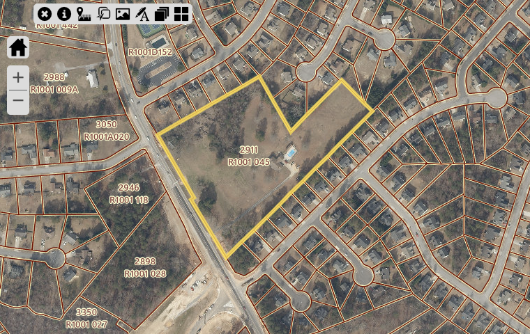
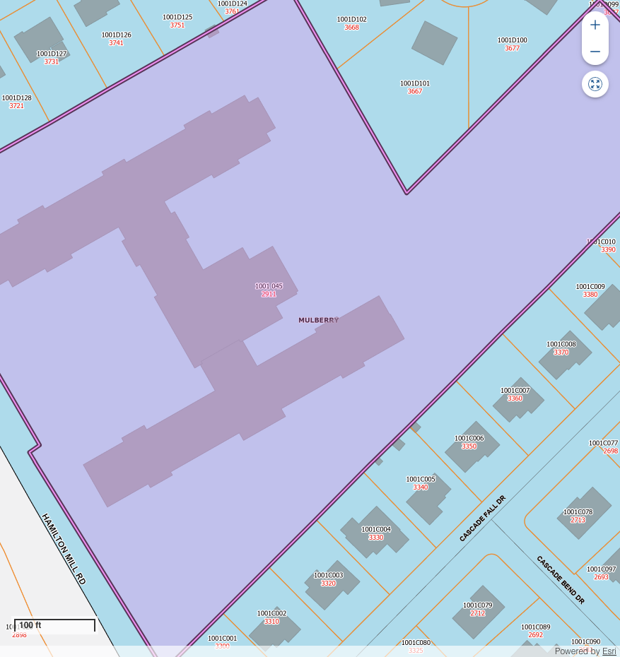

# Land Parcel Report - R1001045

## Overview

This document provides detailed information about the specified parcel of land, including its location, dimensions, zoning, and nearby points of interest.

---

## Parcel Details

| **Attribute**   | **Details**           |
|------------------|-----------------------|
| **PARCEL**    | R1001 045           |
| **OWNER**    | HAMILTON MILL SENIOR CENTER LLC           |
| **SITUSADDRESS**    | 2911 HAMILTON MILL RD           |
| **TAXYEAR**    | 2024           |
| **TAX**    | 43155.41           |
| **PENALTY**    | 0.0           |
| **INTEREST**    | 0.0           |
| **FEE**    | 0.0           |
| **COST**    | 0.0           |
| **TOTALBALANCEDUE**    | 43155.41           |
| **Inst1DueDate**    | 2025-02-01 00:00:00           |
| **MAILINGADDRESS**    | 5035 WALLACE DR           |
| **CITY**    | CUMMING           |
| **STATE**    | GA           |
| **ZIP**    | 30041-3916           |
| **ParcelData**    | nan           |
| **Acres**    | 9.01           |
| **Land Value**    | $3,842,300           |
| **Building Value**    | $7,657,700           |
| **Total Fair Market Value**    | $11,500,000           |
| **ACRES**    | nan           |

---

## Location Map

Below is the approximate location of the parcel:

---

## Land Use Information

### Zoning Regulations
The parcel is zoned ****, allowing for:

Restrictions:

### Utilities
- **Water Supply:** 
- **Electricity:** 
- **Sewer:** 

---

## Nearby Amenities

| **Amenity**        | **Distance** |
|--------------------|--------------|

---

## Photos

### Aerial View

### Vertigis View

### On-Ground View

---

## Contact Information

For inquiries or additional information, contact:

**Name:**   
**Phone:**   
**Email:**   

---

## AI Generated Notes

- Sure, let's analyze the area around the zip code 30519, specifically focusing on the amenities like K-12 schools, parks, and shopping centers. This zip code corresponds to an area in Buford, Georgia, which is part of Gwinnett County. Here are some insights about the amenities you might find in this area:

### Schools
1. **K-12 Education**: The Gwinnett County Public Schools are known for their quality education, and several well-regarded schools serve this area. Specifically, schools like Mill Creek High School, Fort Daniel Elementary School, and Jones Middle School are in proximity, offering strong academic programs and extracurricular activities.

2. **Private and Charter Schools**: In addition to public schools, there are several private and charter school options within a reasonable distance, catering to diverse educational needs and preferences.

### Parks and Recreation
1. **Bogan Park Community Recreation and Aquatic Center**: This popular facility offers a variety of recreational activities, including indoor pools, a gymnasium, and sports fields.

2. **Little Mulberry Park**: Located a short drive away, this park offers beautiful trails, fishing areas, and playgrounds, providing great opportunities for outdoor activities.

3. **Buford Dam Park**: Situated near Lake Lanier, this park provides picnic areas, walking trails, and beautiful views of the lake, making it a perfect spot for family outings.

### Shopping and Dining
1. **Mall of Georgia**: One of the largest malls in the Southeast, this shopping center offers a wide range of retail stores, restaurants, and entertainment options, including a cinema and numerous dining venues.

2. **Buford Corners Shopping Center and Marketplace at Millcreek**: These shopping centers offer additional retail and dining choices, ensuring that residents have access to a variety of goods and services.

3. **Local Dining**: The area features a diverse array of dining options, from casual eateries to more upscale restaurants, covering a wide range of cuisines.

### Transportation and Accessibility
1. **Proximity to Major Highways**: The area is conveniently located near Interstate 85 and State Route 20, providing easy access to downtown Atlanta and other nearby cities.

2. **Public Transportation**: While primarily a car-dependent area, Gwinnett County operates some bus services that connect Buford to other parts of the county.

### Real Estate Considerations
1. **Residential Options**: The area offers a mix of suburban neighborhoods with a range of housing styles and price points, suitable for families, young professionals, and retirees alike.

2. **Community Development**: As part of Gwinnett County’s ongoing development, the area continues to grow with new residential and commercial projects, enhancing its appeal to potential buyers.

These insights highlight some of the favorable attributes of living or investing in the parcel of land located in the 30519 zip code. It's an area rich in amenities that support a high quality of life, with ongoing development promising further enhancements.

- To generate insights for a parcel of land in the specific zip code 30078-7774, located in Snellville, Georgia, we can focus on the availability and proximity of amenities such as K-12 schools, parks, and shopping centers. Here are some relevant insights about this area:

### Educational Facilities:
1. **K-12 Schools:**
   - **Brookwood High School** is a well-regarded public high school in the area, known for its strong academic programs and wide array of extracurricular activities.
   - The area is also served by several elementary and middle schools, such as **Brookwood Elementary School** and **Crews Middle School**, which feed into the Brookwood Cluster known for its excellence in education.
   - Access to quality education in this region is a strong draw for families, contributing to the area's residential appeal.

### Recreational Opportunities:
2. **Parks and Outdoor Activities:**
   - **Briscoe Park** is a notable recreational spot in Snellville, offering a variety of amenities including walking trails, playgrounds, sports fields, and a lake for fishing.
   - **Lenora Park**, located a short drive away, provides additional recreational facilities such as a disc golf course, water park, and spacious picnic areas. 
   - These parks offer considerable opportunities for outdoor leisure and community events, enhancing the area's livability for families and individuals who enjoy an active lifestyle.

### Shopping and Retail:
3. **Shopping Centers:**
   - Snellville is home to the **Shoppes at Webb Gin**, a major shopping destination that hosts a variety of retail stores ranging from boutiques to big-box stores, as well as dining options and entertainment venues.
   - **Snellville Pavilion Shopping Center** offers additional retail and dining selections, contributing to convenient access to everyday necessities and lifestyle services.
   - The presence of these shopping centers supports a convenient urban lifestyle with a balance of shopping, dining, and entertainment options.

### Additional Considerations:
4. **Community and Cultural Factors:**
   - Snellville is known for its strong community spirit and hosts several local events throughout the year, such as the Snellville Farmers Market and community festivals, fostering a sense of belonging and local engagement.
   - The suburban nature of Snellville combined with its proximity to Atlanta provides a blend of tranquil living with easy access to urban amenities.

Overall, the parcel of land in zip code 30078-7774 benefits from a combination of quality educational institutions, ample recreational spaces, and convenient shopping and dining options. These amenities make the area attractive to families and individuals seeking a well-rounded community atmosphere. Investing in or developing land in this area could cater to these demographics, capitalizing on the existing amenities and strong community appeal.

- Certainly! When evaluating a parcel of land in the zip code 30097-5261, it's important to look at the available amenities in the area to understand its attractiveness for potential residents or investors. Here's an overview based on the types of amenities you mentioned:

### Education (K-12 Schools)
The area within the zip code 30097-5261 typically benefits from access to quality public schools, which can be a significant draw for families. Some schools in the surrounding area that might serve this zip code include:

- **Elementary Schools:** Look for well-rated elementary schools nearby, such as Wilson Creek Elementary, which is known for its excellent academic programs.
- **Middle Schools:** An example is River Trail Middle School, which generally receives high marks for academics and extracurricular offerings.
- **High Schools:** Northview High School may serve this area and is often rated highly for its academic performance, college readiness, and variety of advanced placement courses.

### Parks
Access to parks and recreational areas is a significant benefit, especially for families and outdoor enthusiasts:

- **Chattahoochee River National Recreation Area:** This nearby natural area offers trails, water activities, and scenic views, making it a great spot for both recreation and relaxation.
- **Local Parks:** Look for community parks like Rogers Bridge Park, which provide playgrounds, sports fields, and walking trails.

### Shopping Centers
Having convenient access to shopping centers enhances the living experience by providing easy access to retail, dining, and entertainment options:

- **The Forum on Peachtree Parkway:** A popular upscale outdoor shopping center offering a variety of retail stores, restaurants, and cafes.
- **Sugarloaf Mills:** A larger mall-style shopping center located a short drive away, offering a mix of outlet stores, entertainment options, and dining establishments.

### Additional Considerations
- **Transportation:** Proximity to major roads and highways can make commuting easier for residents. Look into the nearby access points to Interstate 85 and State Route 141 for connectivity.
- **Community Facilities:** Libraries, community centers, and other facilities like sports complexes or aquatics centers contribute to community life and can be a plus for prospective residents.

### Conclusion
The 30097-5261 area generally offers strong educational institutions, access to natural and recreational amenities, and robust shopping options. This combination makes it a desirable location for families and individuals looking for a balanced lifestyle with conveniences and quality community resources. Consider how these features align with the needs of potential residents or investors when assessing the value and suitability of the parcel of land.

- To provide insights for a parcel of land in the ZIP code 30041-3916, which is located in Cumming, Georgia, we can consider various aspects such as educational institutions, recreational areas, and shopping options. Let's delve into these amenities:

### Education (K-12 Schools)
1. **Elementary Schools:**
   - The local area may have well-regarded elementary schools offering good educational programs, often praised for dedicated staff and a supportive community.
2. **Middle and High Schools:**
   - Middle and high schools in the area often provide a range of extracurricular activities and have solid academic records. Check specific school ratings on platforms like GreatSchools for more detailed insights.

### Parks and Recreational Areas
1. **Central Park:**
   - This park offers numerous facilities such as sports fields, walking trails, and picnic areas. It is a popular choice for family outings and recreational activities.
2. **Sawnee Mountain Preserve:**
   - Just a short drive away, this preserve offers hiking trails with scenic views and educational programs focused on the environment.

### Shopping Centers
1. **The Collection at Forsyth:**
   - A major shopping destination nearby, featuring a variety of retail stores, dining options, and entertainment venues. It serves as a community hub with events and activities throughout the year.
2. **Local Shops:**
   - There are several local businesses and boutiques that provide a more personalized shopping experience, alongside larger chain stores.

### Additional Considerations
- **Real Estate Market:**
  - The area has seen growth, leading to developments and potential increases in property value.
- **Community Services:**
  - Access to healthcare facilities, community centers, and libraries enhances the attractiveness of the area.
- **Transportation:**
  - Good connectivity via major roads and proximity to public transit options contribute to the convenience of the location.

Overall, the parcel of land in ZIP code 30041-3916 is likely to benefit from a range of amenities that contribute to a high quality of life, making it an attractive area for families and investors alike.
