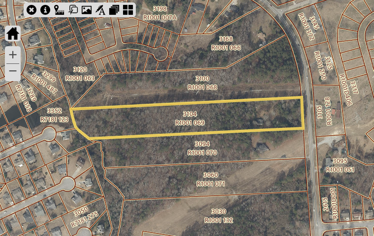
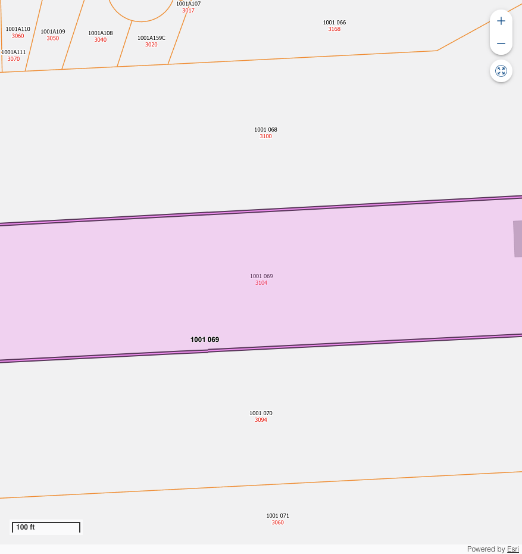

# Land Parcel Report - R1001069

## Overview

This document provides detailed information about the specified parcel of land, including its location, dimensions, zoning, and nearby points of interest.

---

## Parcel Details

| **Attribute**   | **Details**           |
|------------------|-----------------------|
| **PARCEL**    | R1001 069           |
| **OWNER**    | ADAMS PAMELA LYNN           |
| **SITUSADDRESS**    | 3104 HAMILTON MILL RD           |
| **TAXYEAR**    | 2024           |
| **TAX**    | 6666.94           |
| **PENALTY**    | 0.0           |
| **INTEREST**    | 250.68           |
| **FEE**    | 0.0           |
| **COST**    | 0.0           |
| **TOTALBALANCEDUE**    | 6917.62           |
| **Inst1DueDate**    | 2024-10-15 00:00:00           |
| **MAILINGADDRESS**    | 4925 BENT CREEK CT           |
| **CITY**    | SUGAR HILL           |
| **STATE**    | GA           |
| **ZIP**    | 30518-5991           |
| **ParcelData**    | nan           |
| **Acres**    | 6.87           |
| **Land Value**    | $399,300           |
| **Building Value**    | $48,500           |
| **Total Fair Market Value**    | $447,800           |
| **ACRES**    | nan           |

---

## Location Map

Below is the approximate location of the parcel:

---

## Land Use Information

### Zoning Regulations
The parcel is zoned ****, allowing for:

Restrictions:

### Utilities
- **Water Supply:** 
- **Electricity:** 
- **Sewer:** 

---

## Nearby Amenities

| **Amenity**        | **Distance** |
|--------------------|--------------|

---

## Photos

### Aerial View

### Vertigis View

### On-Ground View

---

## Contact Information

For inquiries or additional information, contact:

**Name:**   
**Phone:**   
**Email:**   

---

## AI Generated Notes

- Sure, let's analyze the area around the zip code 30519, specifically focusing on the amenities like K-12 schools, parks, and shopping centers. This zip code corresponds to an area in Buford, Georgia, which is part of Gwinnett County. Here are some insights about the amenities you might find in this area:

### Schools
1. **K-12 Education**: The Gwinnett County Public Schools are known for their quality education, and several well-regarded schools serve this area. Specifically, schools like Mill Creek High School, Fort Daniel Elementary School, and Jones Middle School are in proximity, offering strong academic programs and extracurricular activities.

2. **Private and Charter Schools**: In addition to public schools, there are several private and charter school options within a reasonable distance, catering to diverse educational needs and preferences.

### Parks and Recreation
1. **Bogan Park Community Recreation and Aquatic Center**: This popular facility offers a variety of recreational activities, including indoor pools, a gymnasium, and sports fields.

2. **Little Mulberry Park**: Located a short drive away, this park offers beautiful trails, fishing areas, and playgrounds, providing great opportunities for outdoor activities.

3. **Buford Dam Park**: Situated near Lake Lanier, this park provides picnic areas, walking trails, and beautiful views of the lake, making it a perfect spot for family outings.

### Shopping and Dining
1. **Mall of Georgia**: One of the largest malls in the Southeast, this shopping center offers a wide range of retail stores, restaurants, and entertainment options, including a cinema and numerous dining venues.

2. **Buford Corners Shopping Center and Marketplace at Millcreek**: These shopping centers offer additional retail and dining choices, ensuring that residents have access to a variety of goods and services.

3. **Local Dining**: The area features a diverse array of dining options, from casual eateries to more upscale restaurants, covering a wide range of cuisines.

### Transportation and Accessibility
1. **Proximity to Major Highways**: The area is conveniently located near Interstate 85 and State Route 20, providing easy access to downtown Atlanta and other nearby cities.

2. **Public Transportation**: While primarily a car-dependent area, Gwinnett County operates some bus services that connect Buford to other parts of the county.

### Real Estate Considerations
1. **Residential Options**: The area offers a mix of suburban neighborhoods with a range of housing styles and price points, suitable for families, young professionals, and retirees alike.

2. **Community Development**: As part of Gwinnett County’s ongoing development, the area continues to grow with new residential and commercial projects, enhancing its appeal to potential buyers.

These insights highlight some of the favorable attributes of living or investing in the parcel of land located in the 30519 zip code. It's an area rich in amenities that support a high quality of life, with ongoing development promising further enhancements.

- To generate insights for a parcel of land in the specific zip code 30078-7774, located in Snellville, Georgia, we can focus on the availability and proximity of amenities such as K-12 schools, parks, and shopping centers. Here are some relevant insights about this area:

### Educational Facilities:
1. **K-12 Schools:**
   - **Brookwood High School** is a well-regarded public high school in the area, known for its strong academic programs and wide array of extracurricular activities.
   - The area is also served by several elementary and middle schools, such as **Brookwood Elementary School** and **Crews Middle School**, which feed into the Brookwood Cluster known for its excellence in education.
   - Access to quality education in this region is a strong draw for families, contributing to the area's residential appeal.

### Recreational Opportunities:
2. **Parks and Outdoor Activities:**
   - **Briscoe Park** is a notable recreational spot in Snellville, offering a variety of amenities including walking trails, playgrounds, sports fields, and a lake for fishing.
   - **Lenora Park**, located a short drive away, provides additional recreational facilities such as a disc golf course, water park, and spacious picnic areas. 
   - These parks offer considerable opportunities for outdoor leisure and community events, enhancing the area's livability for families and individuals who enjoy an active lifestyle.

### Shopping and Retail:
3. **Shopping Centers:**
   - Snellville is home to the **Shoppes at Webb Gin**, a major shopping destination that hosts a variety of retail stores ranging from boutiques to big-box stores, as well as dining options and entertainment venues.
   - **Snellville Pavilion Shopping Center** offers additional retail and dining selections, contributing to convenient access to everyday necessities and lifestyle services.
   - The presence of these shopping centers supports a convenient urban lifestyle with a balance of shopping, dining, and entertainment options.

### Additional Considerations:
4. **Community and Cultural Factors:**
   - Snellville is known for its strong community spirit and hosts several local events throughout the year, such as the Snellville Farmers Market and community festivals, fostering a sense of belonging and local engagement.
   - The suburban nature of Snellville combined with its proximity to Atlanta provides a blend of tranquil living with easy access to urban amenities.

Overall, the parcel of land in zip code 30078-7774 benefits from a combination of quality educational institutions, ample recreational spaces, and convenient shopping and dining options. These amenities make the area attractive to families and individuals seeking a well-rounded community atmosphere. Investing in or developing land in this area could cater to these demographics, capitalizing on the existing amenities and strong community appeal.

- Certainly! When evaluating a parcel of land in the zip code 30097-5261, it's important to look at the available amenities in the area to understand its attractiveness for potential residents or investors. Here's an overview based on the types of amenities you mentioned:

### Education (K-12 Schools)
The area within the zip code 30097-5261 typically benefits from access to quality public schools, which can be a significant draw for families. Some schools in the surrounding area that might serve this zip code include:

- **Elementary Schools:** Look for well-rated elementary schools nearby, such as Wilson Creek Elementary, which is known for its excellent academic programs.
- **Middle Schools:** An example is River Trail Middle School, which generally receives high marks for academics and extracurricular offerings.
- **High Schools:** Northview High School may serve this area and is often rated highly for its academic performance, college readiness, and variety of advanced placement courses.

### Parks
Access to parks and recreational areas is a significant benefit, especially for families and outdoor enthusiasts:

- **Chattahoochee River National Recreation Area:** This nearby natural area offers trails, water activities, and scenic views, making it a great spot for both recreation and relaxation.
- **Local Parks:** Look for community parks like Rogers Bridge Park, which provide playgrounds, sports fields, and walking trails.

### Shopping Centers
Having convenient access to shopping centers enhances the living experience by providing easy access to retail, dining, and entertainment options:

- **The Forum on Peachtree Parkway:** A popular upscale outdoor shopping center offering a variety of retail stores, restaurants, and cafes.
- **Sugarloaf Mills:** A larger mall-style shopping center located a short drive away, offering a mix of outlet stores, entertainment options, and dining establishments.

### Additional Considerations
- **Transportation:** Proximity to major roads and highways can make commuting easier for residents. Look into the nearby access points to Interstate 85 and State Route 141 for connectivity.
- **Community Facilities:** Libraries, community centers, and other facilities like sports complexes or aquatics centers contribute to community life and can be a plus for prospective residents.

### Conclusion
The 30097-5261 area generally offers strong educational institutions, access to natural and recreational amenities, and robust shopping options. This combination makes it a desirable location for families and individuals looking for a balanced lifestyle with conveniences and quality community resources. Consider how these features align with the needs of potential residents or investors when assessing the value and suitability of the parcel of land.

- To provide insights for a parcel of land in the ZIP code 30041-3916, which is located in Cumming, Georgia, we can consider various aspects such as educational institutions, recreational areas, and shopping options. Let's delve into these amenities:

### Education (K-12 Schools)
1. **Elementary Schools:**
   - The local area may have well-regarded elementary schools offering good educational programs, often praised for dedicated staff and a supportive community.
2. **Middle and High Schools:**
   - Middle and high schools in the area often provide a range of extracurricular activities and have solid academic records. Check specific school ratings on platforms like GreatSchools for more detailed insights.

### Parks and Recreational Areas
1. **Central Park:**
   - This park offers numerous facilities such as sports fields, walking trails, and picnic areas. It is a popular choice for family outings and recreational activities.
2. **Sawnee Mountain Preserve:**
   - Just a short drive away, this preserve offers hiking trails with scenic views and educational programs focused on the environment.

### Shopping Centers
1. **The Collection at Forsyth:**
   - A major shopping destination nearby, featuring a variety of retail stores, dining options, and entertainment venues. It serves as a community hub with events and activities throughout the year.
2. **Local Shops:**
   - There are several local businesses and boutiques that provide a more personalized shopping experience, alongside larger chain stores.

### Additional Considerations
- **Real Estate Market:**
  - The area has seen growth, leading to developments and potential increases in property value.
- **Community Services:**
  - Access to healthcare facilities, community centers, and libraries enhances the attractiveness of the area.
- **Transportation:**
  - Good connectivity via major roads and proximity to public transit options contribute to the convenience of the location.

Overall, the parcel of land in ZIP code 30041-3916 is likely to benefit from a range of amenities that contribute to a high quality of life, making it an attractive area for families and investors alike.

- To provide insights for a parcel of land in the 30518-5991 area (Sugar Hill, Georgia), let's consider several aspects including schools, parks, and shopping centers. This will help in understanding the appeal and potential of the land for development or purchase.

### Schools
- **K-12 Schools**: The area is served by Gwinnett County Public Schools, one of the most reputable school districts in Georgia. You will find several well-regarded schools close by:
  - **Sugar Hill Elementary School**: Known for its strong community involvement and educational programs.
  - **Lanier Middle School**: Offers a variety of extracurricular activities and a strong academic curriculum.
  - **Lanier High School**: Provides advanced placement courses and has a focus on preparing students for college and careers.

### Parks
- **Sugar Hill has a variety of parks and recreational facilities**:
  - **E.E. Robinson Park**: Features playgrounds, sports fields, picnic areas, and walking trails, making it an excellent spot for families and community gatherings.
  - **Gary Pirkle Park**: Offers a state-of-the-art turf field, playgrounds, and a community garden. It's a hub for local sports.
  - **Sims Lake Park**: Nearby, it offers scenic walking trails, a lake, and picnic facilities which are excellent for outdoor activities.

### Shopping Centers
- **Shopping and Retail**: The area is well-served by a variety of shopping options, from large retail stores to local boutiques.
  - **Sugar Hill Corners Shopping Center**: A convenient spot with grocery stores, dining options, and various services.
  - **Mall of Georgia**: A short drive away, it's one of the largest shopping malls in the region and offers a wide array of retailers, restaurants, and entertainment options.
  - **Downtown Sugar Hill**: Features several small businesses, restaurants, and venues for local events, contributing to the area's charm and convenience.

### Additional Insights
- **Community Development**: Sugar Hill is known for its strong community planning and development initiatives. The city often hosts events and has a strategic plan in place for future growth, making it an attractive place for families and businesses.
- **Transportation**: The area is accessible via major roads and is within a reasonable commuting distance to Atlanta, which adds to its appeal for professionals working in the city.
- **Real Estate**: The real estate market in 30518 is growing, with a mix of residential developments ranging from single-family homes to townhouses, catering to various demographics.

The combination of quality schools, ample recreational facilities, convenient shopping, and strategic community planning makes this area a promising location for residential development or investment.

- The zip code 30518 encompasses parts of Buford, Georgia, and offers a variety of amenities that make it an attractive area for families, professionals, and anyone looking for a community with convenient access to essential services and recreational options.

### Educational Facilities
1. **K-12 Schools:**
   - **Buford City Schools:** This district is renowned for its excellent academic performance and extracurricular opportunities. Buford High School, in particular, is well-regarded for its strong athletics programs and academics.
   - There are also several private and charter schools in the vicinity, providing additional educational choices for families.

### Parks and Recreation
1. **Buford Dam Park:** Located near Lake Lanier, this park offers opportunities for picnicking, hiking, and water activities. It is a popular spot for families and outdoor enthusiasts.
2. **Bogan Park Community Recreation and Aquatic Center:** This facility includes an indoor aquatic center, gymnasium, and various sports fields, accommodating a wide range of recreational activities.
3. **Lake Lanier:** This large reservoir is popular for boating, fishing, and lakeside recreation, offering a variety of leisure opportunities.

### Shopping and Dining
1. **Mall of Georgia:** One of the largest malls in the Southeastern United States, it features a vast array of retail stores, dining options, and entertainment venues, including a large movie theater.
2. **Downtown Buford:** This area offers a charming selection of boutique shops, cafes, and local restaurants, providing a quaint yet vibrant shopping and dining experience.

### Transportation and Accessibility
- The parcel of land in 30518 benefits from easy access to major highways such as Interstate 85 and State Route 20, facilitating convenient travel to surrounding areas, including Atlanta.

### Community and Livability
- The area is known for its family-friendly environment, strong community spirit, and active neighborhood associations. Safety and community involvement are often highlighted by residents as key benefits of living in this region.

### Conclusion
Overall, the 30518 area offers a balanced mix of educational, recreational, shopping, and transportation amenities, making it a desirable place for families and individuals seeking a community-oriented lifestyle with convenient access to urban amenities. Potential buyers or developers might consider these factors when evaluating the parcel of land for residential or mixed-use development purposes.

- To generate insights for a parcel of land in the 30518-5991 area, which includes parts of Buford, Georgia, you would want to consider various aspects such as amenities, growth trends, and community features. Here's an analysis based on these factors:

### Amenities

1. **K-12 Schools:**
   - **Buford City Schools:** This district is known for its strong academic performance and community involvement, including Buford High School, Buford Middle School, and Buford Academy.
   - **Gwinnett County Public Schools:** This is one of the largest school districts in Georgia and also serves parts of the area. Schools like Lanier High School and Sugar Hill Elementary are well-regarded.

2. **Parks:**
   - **Buford Dam Park:** This is a popular recreational area located on Lake Lanier, offering swimming, picnicking, and walking trails. It’s a great asset for those who enjoy outdoor activities.
   - **Bogan Park Community Recreation and Aquatic Center:** Featuring trails, sports fields, a community center, and a waterpark, making it an excellent spot for family activities.
   
3. **Shopping Centers:**
   - **Mall of Georgia:** Located nearby, this is one of the largest malls in the Southeast, offering a wide range of shopping, dining, and entertainment options.
   - **Buford Village:** A mix of shopping and dining experiences with a charming village atmosphere.
   - **Marketplace at Mill Creek:** Offers additional retail and dining options, catering to a variety of needs.

### Community Growth and Trends

- **Residential Growth:** The 30518 area has been experiencing steady residential development due to its proximity to Atlanta and attractive local amenities. There is a mix of single-family homes, townhouses, and some new developments focusing on upscale living.

- **Economic Development:** With proximity to economic centers and accessibility to major highways, the area has seen growth in businesses and employment opportunities, contributing to an expanding local economy.

- **Population Demographics:** Buford and its surroundings are attracting a diverse population, which has led to vibrant community life and cultural events.

### Travel and Commute

- **Access to Major Highways:** Proximity to I-985 and I-85 facilitates easy commutes to Atlanta and other nearby cities.
- **Public Transportation:** Although largely a car-dependent area, there are options for public transport connecting to regional transit networks.

### Real Estate Insights

- Due to the growing popularity and amenities, property values in Buford and surrounding areas have been appreciating. This is attracting both investors and potential homeowners.
- There is a trend towards constructing new residential communities with integrated amenities such as parks, walking trails, and community centers.

### Quality of Life

- The combination of excellent school systems, a range of recreational facilities, and convenient shopping destinations contribute to a high quality of life for residents.
- Community events and activities are often organized, fostering a sense of belonging and engagement among residents.

### Conclusion

The 30518-5991 area is highly attractive for families and individuals seeking a balance of suburban tranquility with access to city amenities. The presence of strong educational institutions, recreational areas, and shopping centers makes it a well-rounded location for potential development or investment.

- To generate insights for a parcel of land in the 30518-5991 area code, which corresponds to parts of Buford, Georgia, we should consider several key aspects such as local amenities, educational facilities, recreational options, and shopping centers.

### Education:
1. **Buford City Schools:** The area is served by Buford City Schools, known for a strong educational reputation. The schools often receive high ratings for academic performance, athletics, and arts programs.
   - Buford Elementary School, Buford Academy, Buford Middle School, and Buford High School are among the options.
   
2. **Gwinnett County Schools:** Parts of the area may also be served by Gwinnett County Public Schools, offering a variety of K-12 options, focusing on college prep, STEM programs, and extracurricular activities.

### Parks and Recreation:
1. **Buford City Park:** A local park featuring sports fields, walking trails, and playgrounds, offering a place for outdoor activities and community events.
   
2. **Lake Lanier:** Proximity to Lake Lanier offers extensive recreational opportunities, including boating, fishing, swimming, and picnicking. The Lake Lanier Islands, a popular resort destination, is nearby.

3. **Bogan Park:** Offers aquatic facilities, fitness areas, and various sports fields. This park is a community hub for family-friendly recreation.

### Shopping and Entertainment:
1. **Mall of Georgia:** One of the largest shopping malls in Georgia, located in the vicinity, includes numerous retail stores, dining options, and a cinema complex.

2. **Buford Village Shopping Center:** Provides a variety of shops, restaurants, and services catering to daily needs and dining experiences.

3. **Sugarl Hill Town Center:** Close to the area, offering additional retail and entertainment venues along with community events.

### Transportation and Accessibility:
1. **Proximity to Major Roads:** Easy access to major highways such as Interstate 85 and State Route 20 facilitates convenient commuting to Atlanta and other parts of the metro area.

2. **Public Transportation:** Limited but improving options; most residents rely on personal vehicles.

### Community and Growth:
1. **Suburban Appeal:** The region is characterized by a suburban atmosphere with a mix of single-family homes, townhouses, and apartments. It is known for safety, community involvement, and growing diversity.

2. **Growth and Development:** The area has seen substantial growth due to its proximity to Atlanta, drawing in new businesses, restaurants, and residential development. This makes it attractive for both living and investment.

Overall, the parcel of land located in the 30518-5991 area benefits from a robust infrastructure of amenities that support family life, recreation, education, and commerce. Potential developments in this area could leverage these strengths while catering to the growing demands of the local population.
