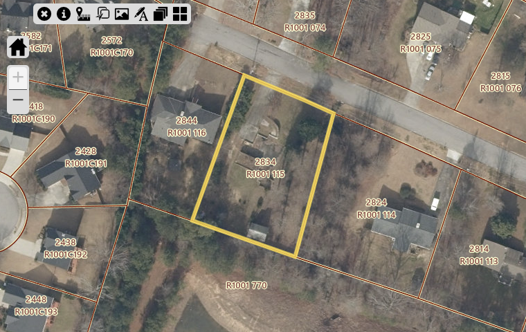
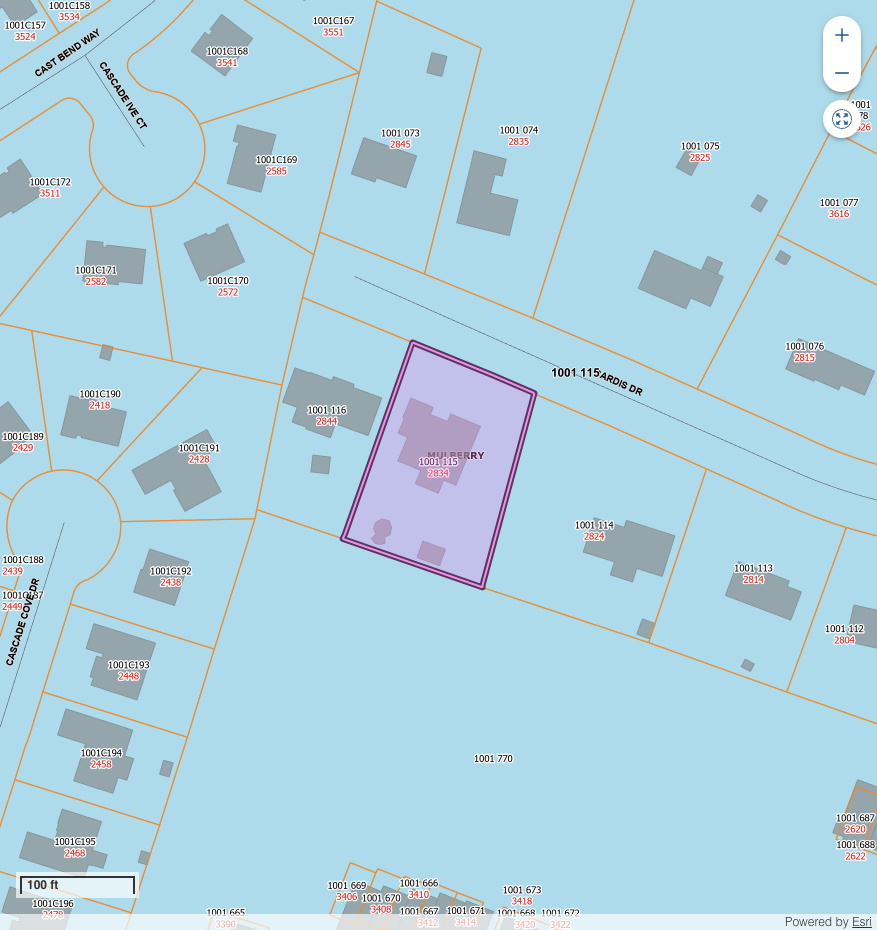

# Land Parcel Report - R1001115

## Overview

This document provides detailed information about the specified parcel of land, including its location, dimensions, zoning, and nearby points of interest.

---

## Parcel Details

| **Attribute**   | **Details**           |
|------------------|-----------------------|
| **PARCEL**    | R1001 115           |
| **OWNER**    | URUC NICOLETA           |
| **SITUSADDRESS**    | 2834 SARDIS DR           |
| **TAXYEAR**    | 2024           |
| **TAX**    | 14607.81           |
| **PENALTY**    | 0.0           |
| **INTEREST**    | 549.25           |
| **FEE**    | 0.0           |
| **COST**    | 0.0           |
| **TOTALBALANCEDUE**    | 15157.06           |
| **Inst1DueDate**    | 2024-10-15 00:00:00           |
| **MAILINGADDRESS**    | 2834 SARDIS DR           |
| **CITY**    | BUFORD           |
| **STATE**    | GA           |
| **ZIP**    | 30519-4136           |
| **ParcelData**    | nan           |
| **Acres**    | 0.49           |
| **Land Value**    | $68,000           |
| **Building Value**    | $934,700           |
| **Total Fair Market Value**    | $1,002,700           |
| **ACRES**    | nan           |

---

## Location Map

Below is the approximate location of the parcel:

---

## Land Use Information

### Zoning Regulations
The parcel is zoned ****, allowing for:

Restrictions:

### Utilities
- **Water Supply:** 
- **Electricity:** 
- **Sewer:** 

## Photos

### Aerial View

### Vertigis View

### On-Ground View

---

## Contact Information

For inquiries or additional information, contact:

**Name:**   
**Phone:**   
**Email:**   

---

## AI Generated Notes

- ### Real Estate Insights for Parcel in Zip Code 30519-4117

#### Overview
The parcel of land located in zip code 30519-4117 offers a range of amenities that enhance its attractiveness for potential residential development. This area is situated in Gwinnett County, Georgia, which is known for its robust community services and family-friendly environment.

#### Education
- **K-12 Schools**: The local school district in this area is highly regarded for its comprehensive educational programs. The district includes top-rated schools such as:
  - **Mill Creek High School**: Known for its extensive Advanced Placement (AP) offerings and strong extracurricular activities.
  - **Frank N. Osborne Middle School**: Offers a variety of academic clubs and sports programs.
  - **Duncan Creek Elementary School**: Recognized for its focus on STEM education and strong parent-teacher community.

  Parents in the area can be confident in the quality of education their children will receive, which is a significant draw for families.

#### Parks and Recreation
- **Bogan Park**: Features a wide range of recreational facilities including swimming pools, sports fields, and walking trails. It's a perfect spot for family outings and community events.
- **Little Mulberry Park**: Offers expansive green spaces, hiking trails, and a lake for fishing and boating. It’s popular for both relaxing strolls and vigorous outdoor activities.
  
  The availability of well-maintained parks emphasizes the community’s commitment to promoting an active lifestyle and provides ample opportunities for outdoor recreation.

#### Shopping and Retail
- **Mall of Georgia**: One of the largest shopping centers in the Southeast, featuring a variety of retail stores, dining options, and entertainment venues, such as a movie theater and interactive activities.
- **Nearby Shopping Centers**: Include big-box retailers and local boutique stores that provide a diverse shopping experience.

  The proximity to these shopping destinations offers convenience and adds value to potential residential properties, appealing to those who appreciate accessibility to amenities.

#### Conclusion
The parcel of land in 30519-4117 is ideally located within reach of excellent educational institutions, abundant recreational opportunities, and convenient shopping centers. These features make it an attractive option for developers targeting families and individuals seeking a balance of suburban tranquility and urban convenience. The area's infrastructure and amenities significantly enhance its desirability, making it a promising investment for residential development.

- ### Real Estate Insights for Parcel of Land in Zip Code 30078-7774

#### Overview
Located in the vibrant area of Snellville, Georgia, the parcel of land in the 30078-7774 zip code offers substantial opportunities for development, whether residential or commercial. This area is characterized by strong community engagement and a balanced mix of suburban comfort and urban convenience.

#### Educational Amenities
1. **Highly Rated Schools**: The area is served by the Gwinnett County Public Schools system, known for its excellence. Nearby institutions include:
   - **South Gwinnett High School**: Offers a wide range of AP courses and extracurricular activities.
   - **Snellville Middle School**: Recognized for its strong academic programs and supportive learning environment.
   - **Norton Elementary School**: Known for its dedicated teaching staff and engaging curriculum.

2. **Private and Charter Schools**: Options such as Shiloh Hills Christian School provide alternatives to public schooling, catering to diverse educational needs and preferences.

#### Recreation and Parks
1. **Briscoe Park**: A short drive away, this park offers 87 acres of recreational activities, including walking trails, playgrounds, sports fields, and a lake for fishing.

2. **Lenora Park**: Features include a splash pad, multiple sports facilities, and a disc golf course, providing diverse options for outdoor activities.

3. **Community Events**: The area hosts various events, fostering a strong sense of community such as festivals, farmer's markets, and seasonal celebrations, leveraging the outdoor spaces effectively.

#### Shopping and Dining
1. **Snellville's Towne Center**: This area serves as a hub with various retail shops, restaurants, and service providers. Key tenants include big-box stores and boutique retailers, catering to a broad range of consumer needs.

2. **The Shoppes at Webb Gin**: Located within convenient proximity, this shopping center offers upscale retail options and a variety of dining establishments from casual eateries to fine dining, enhancing the living experience in the area.

3. **Dining Scene**: The culinary variety ranges from southern comfort food to international cuisines, reflecting Snellville's diverse cultural backdrop.

#### Transportation and Accessibility
- **Access To Major Highways**: Convenient access to major thoroughfares like U.S. Route 78 and Ronald Reagan Parkway ensures easy commutes to downtown Atlanta and other parts of the greater metro area.
- **Public Transit Options**: The area is served by Gwinnett County Transit, providing accessible public transportation options for residents and visitors alike.

#### Market Potential
1. **Growing Demand**: The proximity to high-quality amenities makes this area attractive for families, young professionals, and retirees, indicating strong future demand.
2. **Real Estate Trends**: Positive trends suggest a steady appreciation in property values, supported by consistent community development efforts and infrastructure improvements.

#### Conclusion
This parcel of land in the 30078-7774 zip code represents a promising opportunity for developers and investors, given its strategic location and the array of amenities supporting a high quality of life. Potential buyers and developers can expect a synergistic blend of educational, recreational, and commercial facilities that cater to modern living demands.

- **Real Estate Insights for Parcel in ZIP Code 30097-5261**

**Location Overview:**
The parcel of land located in ZIP code 30097-5261 is part of a vibrant community in Johns Creek, Georgia. This area is renowned for its beautiful suburban setting, excellent amenities, and high quality of life, making it a desirable location for families and individuals alike.

**Educational Amenities:**
The area is served by some of the top-rated schools in the state of Georgia, providing an excellent education system for families:

1. **Northview High School**: Known for its academic excellence, Northview High School consistently ranks among the top high schools in Georgia, offering a robust curriculum and numerous extracurricular activities.
   
2. **River Trail Middle School**: This school is recognized for a strong focus on STEM education and offers a supportive environment for adolescent learning and development.

3. **Shakerag Elementary School**: With a commitment to fostering early learning and development, this elementary school is well-rated and offers a wide range of programs to nurture young students.

**Recreational Amenities:**
Residents in this area have access to a variety of parks and recreational facilities, suitable for both relaxation and active lifestyles:

1. **Newtown Park**: A spacious park featuring walking trails, recreational fields, playgrounds, and a dog park. It is a hub for community events and activities.
   
2. **Chattahoochee River National Recreation Area**: Offers scenic trails and opportunities for outdoor activities such as hiking, fishing, and kayaking, providing a natural retreat within the community.

**Shopping and Dining:**
The parcel is in proximity to an array of shopping centers and dining options, catering to diverse tastes and needs:

1. **The Forum on Peachtree Parkway**: An open-air shopping center featuring a variety of retail stores, boutiques, and dining establishments, offering both convenience and luxury.
   
2. **Avalon**: Just a short drive away, Avalon is a mixed-use development with high-end shopping, top restaurants, and entertainment options, making it a popular choice for a day out.

**Community and Lifestyle:**
Johns Creek is known for its strong community feel, with numerous neighborhood associations and community events. The area hosts festivals, farmers markets, and cultural events, fostering a sense of belonging and community spirit.

**Transportation:**
The zip code 30097-5261 enjoys convenient access to major highways, providing easy commutes to nearby cities such as Atlanta and access to surrounding areas. Public transportation options, while limited, are supplemented by community-driven carpooling initiatives and rideshare services.

**Conclusion:**
This parcel of land in ZIP code 30097-5261 presents an attractive opportunity for residential development or investment. With its excellent schools, abundant recreational facilities, and vibrant shopping and dining scene, this area offers a balanced lifestyle amidst a supportive and thriving community.

- **Real Estate Insights for Zip Code 30041-3916**

**Location Overview:**
The parcel of land located in the 30041-3916 zip code area is situated in a vibrant and highly sought-after community within Forsyth County, Georgia. This region is known for its excellent blend of suburban charm and convenient access to urban amenities, making it an attractive location for families and individuals alike.

**Education Facilities:**
- **K-12 Schools:** The area is served by some of the most highly regarded schools in the Forsyth County School District, known for their exceptional academic performance and comprehensive extracurricular programs. The district includes:
  - **Chattahoochee Elementary School:** Known for its strong community involvement and innovative learning approaches.
  - **Lakeside Middle School:** Offers a diverse range of programs, including STEM and arts, to cater to various student interests.
  - **Forsyth Central High School:** Features a range of Advanced Placement courses and career technical education pathways, ensuring students are well-prepared for higher education and future careers.

**Recreational Amenities:**
- **Parks and Outdoor Spaces:** Residents in the 30041-3916 area enjoy access to multiple parks and recreation facilities that provide ample opportunities for outdoor activities:
  - **Mary Alice Park:** A popular destination featuring a marina, picnic areas, and sandy beach, ideal for family outings and water sports.
  - **Sawnee Mountain Preserve:** Offers hiking trails with breathtaking views, an ideal spot for nature enthusiasts and fitness activities.
  - **Caney Creek Preserve:** Known for its scenic trails, playgrounds, and sports fields, catering to both leisurely strolls and active recreation.

**Shopping and Dining:**
- **Retail Centers:** The area boasts several shopping centers that provide a variety of retail and dining options to cater to different preferences:
  - **The Collection at Forsyth:** A premier outdoor shopping complex with a mix of national retailers, boutique shops, and diverse dining experiences, including both casual and fine dining.
  - **Market Place Boulevard:** Hosts numerous big-box retailers, specialty stores, and convenient services, providing a comprehensive shopping experience for residents.

**Community Highlights:**
- The community in the 30041-3916 area is known for its friendly atmosphere and active involvement. Neighborhood events and activities foster a strong sense of community, making it a desirable place to live.
- Forsyth County’s economic growth and infrastructure development are expected to continue, enhancing the area’s appeal and potential for property value appreciation.

**Conclusion:**
The parcel of land in zip code 30041-3916 presents an excellent opportunity for real estate investment or development. Its proximity to top-rated schools, abundant recreational and shopping amenities, along with a warm community atmosphere, create a highly desirable living environment that is attractive to families and individuals seeking a balanced lifestyle.

- ### Real Estate Insight Report for Parcel in Zip Code 30518-5991

**Location Overview:**
The parcel of land in question is located within the 30518 zip code, which encompasses parts of Buford, Georgia. This area is part of Gwinnett County, known for its thriving community and proximity to the burgeoning Atlanta metropolitan area.

**Educational Amenities:**
- **K-12 Schools:** The 30518 zip code is served by the Gwinnett County Public School District, one of the largest and most reputable school districts in Georgia. Key schools in the area include Buford Elementary, Buford Middle School, and Buford High School, all known for strong academic performances, comprehensive educational programs, and robust extracurricular activities. The proximity to quality education institutions makes this location highly appealing to families.

**Recreational Amenities:**
- **Parks:** Residents of the 30518 area have access to a variety of parks and recreational facilities. The nearby Bogan Park offers multipurpose sports fields, a swimming pool, nature trails, and picnic areas, catering to a diverse array of outdoor activities. Additionally, the Chattahoochee River National Recreation Area provides scenic trails and opportunities for water activities such as fishing, kayaking, and canoeing, appealing to outdoor enthusiasts and families seeking leisure activities close to nature.

**Shopping and Dining:**
- **Shopping Centers:** The area is home to several shopping options that add to the convenience and appeal of the location. The Mall of Georgia, one of the largest shopping malls in the Southeast, is accessible and features a wide variety of retailers, dining options, and entertainment venues. Additional shopping centers with grocery stores, boutiques, and service outlets are conveniently located within a short drive.
- **Dining:** The area offers a rich variety of dining options, from local eateries and cafes to well-known restaurant chains, providing diverse culinary experiences for residents and visitors alike.

**Transportation and Accessibility:**
- The 30518 area benefits from its strategic location with easy access to major highways, including Interstate 85 and the recently expanded State Route 20. This contributes to convenient commuting possibilities to nearby cities such as Atlanta, enhancing the area's desirability for professionals who work in the metropolitan area but prefer the reliability and comfort of suburban living.

**Community and Growth Potential:**
- **Demographics & Growth:** The population in the Buford area has seen significant growth, driven by its affordability compared to more urban centers, quality of life, and availability of larger residential parcels. This growing community ensures future appreciation potential for investments in real estate.
- **Community Events:** The area hosts numerous local events and festivals throughout the year, contributing to a cohesive and active community spirit. 

**Conclusion:**
Zip code 30518 offers a prime location with a blend of quality education, abundant recreational opportunities, and robust shopping and dining options. The strategic access to transportation routes further enhances its appeal, making it an attractive settlement for families, professionals, and retirees alike. This parcel benefits from the ongoing demographic growth and development in Gwinnett County, suggesting strong potential for residential and commercial investment opportunities.

- Certainly! Here's a set of insights for a parcel of land located in the 30518-5991 area, focusing on amenities that could appeal to potential buyers or investors:

---

**Real Estate Insights: 30518-5991**

**Location Overview:**
The parcel of land in the 30518-5991 zip code is part of the vibrant community of Buford, Georgia, known for its family-friendly atmosphere and robust local amenities. This area offers a balanced blend of urban convenience and suburban charm, making it an attractive option for families, professionals, and investors alike.

**Educational Facilities:**
- **Buford City School District:** This district is recognized for its excellence in education and commitment to student success. It provides a nurturing environment with highly rated K-12 schools, making the area extremely appealing to families with school-age children.
- **Buford High School:** Known for its strong academic programs and extracurricular activities, Buford High School has a reputation for preparing students for post-secondary success.
- **Private and Charter Schools:** In addition to public schools, there are several quality private and charter schooling options in the vicinity, offering diverse educational philosophies and curriculums.

**Parks and Recreational Spaces:**
- **Buford Dam Park:** Located near Lake Lanier, this park offers beautiful natural scenery, picnic spots, and walking trails. It's perfect for families and individuals who enjoy outdoor activities and nature.
- **Bogan Park Community Recreation and Aquatic Center:** This facility provides recreational programs, an indoor pool, sports courts, and playgrounds. It serves as a hub for community engagement and healthy living.
- **Historic Downtown Buford:** A short drive away, this area offers a charming atmosphere with unique shops, art galleries, and dining options, often hosting community events that enhance the small-town feel of Buford.

**Shopping and Commercial Hubs:**
- **Mall of Georgia:** Just a convenient drive from the parcel, this is one of the largest malls in the region, featuring a wide array of retail stores, dining options, and entertainment venues, including a movie theater.
- **Marketplace at Millcreek:** This shopping center offers a variety of essential services and popular retail outlets, ensuring residents have access to everyday necessities.

**Transportation and Accessibility:**
- The area benefits from nearby major highways, including Interstate 85 and State Route 20, providing easy access to neighboring cities and the wider Atlanta metropolitan area.
- Public transportation options and proximity to major thoroughfares enhance connectivity, making daily commutes and travel straightforward for residents.

**Potential Development Opportunities:**
Given the combination of high-quality schools, recreational spaces, and robust shopping and dining options, the land parcel is optimally positioned for residential development catering to families and young professionals seeking a balanced lifestyle. Additionally, there are opportunities for mixed-use developments that can further enhance community engagement and local economy.

**Conclusion:**
The 30518-5991 zip code offers an enviable combination of educational excellence, recreational richness, and commercial convenience. This makes it a prime consideration for real estate investors and homebuyers aiming to capitalize on Buford's thriving community environment.

--- 

This report should provide a comprehensive overview for potential buyers or investors assessing the parcel of land in this zip code.

- ### Real Estate Report: Parcel of Land in Zip Code 30518-5991

#### Overview
The parcel of land situated in the 30518-5991 area offers a unique blend of suburban tranquility and urban convenience, making it an attractive location for residential development or investment. It is located in Buford, Georgia, which is part of Gwinnett County, known for its family-friendly atmosphere and robust infrastructure.

#### Educational Facilities
The area is well-served by several reputable K-12 schools, which are part of the Gwinnett County Public Schools and Buford City School System, both renowned for their commitment to academic excellence and comprehensive extracurricular programs. Notable schools in the vicinity include:

- **Buford High School**: Known for its academic achievements and extracurricular success, offering advanced placement courses and a strong athletics program.
- **Buford Middle School**: Provides a robust curriculum with a focus on student engagement and community involvement.
- **Buford Academy**: An elementary school with a focus on foundational learning and student development.

#### Recreational Parks
Residents in the 30518-5991 area enjoy access to several parks and recreational facilities, which offer outdoor activities and family-friendly amenities:

- **Bogan Park Community Recreation & Aquatic Center**: Features indoor and outdoor pools, sports facilities, and numerous programs for all ages.
- **Buford Dam Park**: Located near Lake Lanier, offering picnic areas, walking trails, and stunning lake views. Ideal for fishing, boating, and family outings.
- **Gwinnett Environmental and Heritage Center**: Provides nature trails, interactive exhibits, and educational programs focused on sustainability and the environment.

#### Shopping and Retail Centers
The area boasts convenient access to a variety of shopping and dining options, ensuring residents have everything they need within easy reach:

- **Mall of Georgia**: One of the largest shopping destinations in the Southeast, featuring major retailers, diverse dining options, and entertainment facilities such as a state-of-the-art movie theater.
- **Buford Corners Shopping Center**: Offers a mix of big-box retailers, specialty stores, and casual dining, catering to a wide range of shopping needs.
- **Historic Downtown Buford**: Known for its charming boutiques, art galleries, and locally-owned restaurants, adding a unique small-town touch to the shopping experience.

#### Additional Insights
- **Transportation**: The area benefits from well-maintained roads and proximity to major highways like Interstate 85 and State Route 20, ensuring easy commutes to Atlanta and neighboring cities.
- **Community Environment**: The neighborhood is characterized by a strong sense of community, supported by local events, farmers markets, and cultural festivals.
- **Real Estate Potential**: The combination of quality amenities and strategic location makes this parcel ideal for families seeking convenience without sacrificing lifestyle quality, as well as for investors looking to capitalize on a growing market.

In conclusion, the land parcel in the 30518-5991 zip code offers an excellent opportunity for development, capitalizing on its proximity to quality educational institutions, vibrant parks, and comprehensive shopping amenities. These factors position it as a prime spot for prospective homeowners and real estate investors alike.

- ### Real Estate Insights: Parcel of Land in Zip Code 30518-5991

#### Overview
The parcel of land located within the zip code 30518-5991 offers a unique opportunity for residential development or investment. Situated in the vibrant and growing community of Buford, Georgia, this area is characterized by its access to quality educational institutions, abundant recreational parks, and convenient shopping centers—making it an attractive location for families and potential homeowners.

#### Educational Facilities
- **Buford City Schools:** The parcel benefits from proximity to the highly-rated Buford City School District, known for its comprehensive K-12 education and exceptional academic performance. The schools in this district consistently receive accolades for their programs, student outcomes, and modern facilities.
- **Nearby Schools:**
  - **Buford Elementary School:** Renowned for its innovative teaching methods and community involvement, providing a nurturing environment for young learners.
  - **Buford High School:** Offers a wide range of advanced placement courses, sports programs, and extracurricular activities.

#### Recreational Parks
- **Buford Dam Park:** Just a short drive away, Buford Dam Park offers extensive outdoor activities, including hiking trails, picnic areas, and scenic views of Lake Lanier. This park is perfect for family outings and nature enthusiasts.
- **Bogan Park Community Recreation & Aquatic Center:** Features a state-of-the-art aquatic center with swim classes, indoor and outdoor sports facilities, and large event spaces. It's a hub for community engagement and personal wellness.

#### Shopping and Dining
- **Mall of Georgia:** As one of the largest shopping destinations nearby, the Mall of Georgia provides an extensive array of retail stores, dining options, and entertainment. National brands and local boutiques make shopping convenient and diverse.
- **Historic Downtown Buford:** Offers a charming blend of artisanal shops, cafes, and restaurants, providing a unique shopping and dining experience that appeals to both residents and visitors looking for something distinct.

#### Transportation and Accessibility
- The area is well-connected by major highways, including Interstate 85 and U.S. Route 23, facilitating easy commutes to Atlanta and surrounding regions.
- Public transportation options and nearby Hartsfield-Jackson Atlanta International Airport further enhance the accessibility of the area.

#### Community and Lifestyle
- The local community in the 30518 area is diverse and engaged, with numerous events and initiatives that foster a strong sense of belonging and active citizenship.
- A combination of suburban tranquility and proximity to urban amenities makes this parcel ideal for those seeking a balanced lifestyle.

#### Conclusion
This parcel of land in the 30518-5991 zip code holds significant potential for development. Its strategic location, coupled with its access to top-tier educational institutions, recreational facilities, and shopping centers, creates an appealing proposition for real estate investors and potential homebuyers alike. The continuous development and community atmosphere further elevate its desirability as a prime residential locale.

- ### Real Estate Insights for Parcel of Land in Zip Code 30519-4136

**Overview**
The parcel of land situated within the zip code 30519-4136 is strategically located in a vibrant community featuring a variety of amenities that enhance lifestyle quality and offer strong potential for residential and commercial development. This area is renowned for its family-friendly environment, highly rated educational institutions, numerous recreational options, and convenient access to shopping centers.

**Educational Institutions**
1. **K-12 Schools**: 
   - **Mill Creek High School**: This school is part of the esteemed Gwinnett County Public Schools district, which is recognized for high academic standards and diverse extracurricular programs. The proximity of such a reputable high school adds significant value to the community.
   - **Frank N. Osborne Middle School**: Known for its commitment to providing a balanced curriculum with focus on both academics and personal development.
   - **Duncan Creek Elementary School**: Offers a safe and nurturing environment for young learners, focusing on foundational education with an innovative approach.

**Parks and Recreation**
1. **Bogan Park Community Recreation and Aquatic Center**: Offers a variety of facilities including an indoor aquatic center, sports fields, playgrounds, and walking trails. This center provides residents with a comprehensive recreational experience all year round.
2. **Little Mulberry Park**: Known for its picturesque walking and biking trails, picnic areas, and disc golf course. Popular among families and nature enthusiasts, it serves as a serene retreat just a short drive away.

**Shopping and Retail**
1. **Mall of Georgia**: As one of Georgia's largest shopping centers, it features a diverse range of retail options, dining establishments, and entertainment facilities including a state-of-the-art movie theater. Its presence underscores the region's role as a retail hub.
2. **Publix and Kroger Grocery Stores**: Multiple grocery outlets within the area provide residents with convenient options for their daily needs.
3. **Local Boutiques and Specialty Shops**: Complementing the larger retail establishments, the area includes a selection of unique local shops that lend character and community support to the shopping experience.

**Transportation and Accessibility**
- The parcel benefits from easy access to major highways such as I-85 and SR 316, ensuring seamless connectivity to Atlanta and surrounding cities, which is ideal for both commuting residents and visiting shoppers.
- Public transportation options and well-maintained roadways facilitate ease of movement within the community, further enhancing livability.

**Conclusion**
This parcel of land in zip code 30519-4136 presents an excellent opportunity for investment given its proximity to essential amenities that cater to a wide array of lifestyle needs. The presence of top-tier educational institutions, extensive recreational facilities, and a strong retail presence positions this area as a desirable location for potential homeowners and businesses. Real estate developers and investors can leverage these community attributes to attract families and commerce, fostering growth and prosperity in the region.

- ## Real Estate Insights for Parcel in Zip Code 30519-4136

### Location Overview
The parcel of land located in zip code 30519-4136 is situated in a vibrant community within the larger Gwinnett County, Georgia. This area is known for its family-friendly environment, excellent schools, and convenient access to amenities, making it desirable for residential development.

### Educational Facilities
- **K-12 Schools**: The area is served by the highly-rated Gwinnett County Public School District, known for its commitment to educational excellence. Several schools nearby have received accolades for academic performance and community involvement:
  - **Elementary Schools**: Located within a short drive, several top-tier elementary schools provide foundational education.
  - **Middle Schools**: Quality middle schools focusing on comprehensive curriculums and extracurricular activities.
  - **High Schools**: High schools in the area offer advanced placement courses, diverse extracurricular programs, and robust college preparatory support.

### Parks and Recreational Opportunities
- **Parks**: The community enjoys access to numerous parks that offer a range of outdoor activities. These green spaces feature walking trails, playgrounds, and sports facilities, fostering an active lifestyle. Some popular parks include:
  - **Bogan Park**: Offers an aquatic center, sports fields, and picnic areas, making it a perfect spot for family outings and community events.
  - **Rabbit Hill Park**: Known for its expansive open spaces and well-maintained trails, it's ideal for walking, jogging, and recreational sports.

### Shopping and Dining
- **Shopping Centers**: Proximity to various shopping centers ensures residents have easy access to retail and dining options. These centers include well-known national retailers as well as local boutiques:
  - **Mall of Georgia**: One of the largest shopping destinations in the Southeast, offering an extensive range of shopping and entertainment options.
  - Smaller retail complexes pepper the area, providing convenient access to groceries, home goods, and personal services.
- **Dining**: The area offers a rich culinary scene with an array of restaurants offering diverse cuisines, from casual eateries to fine dining experiences.

### Transportation and Accessibility
- **Road Access**: Conveniently located near major highways, including Interstate 85, providing easy commutes to neighboring cities and downtown Atlanta.
- **Public Transport**: Public transportation options are available, contributing to the ease of travel within the region.

### Community and Lifestyle
- **Community Engagement**: The community is known for its active engagement and offers numerous events and activities throughout the year, fostering a tight-knit neighborhood feel.
- **Safety and Comfort**: The area boasts a relatively low crime rate, contributing to its reputation as a safe and inviting place to live and raise a family.

### Market Potential
- With its strong local schools, abundant recreational amenities, and proximity to shopping and transportation hubs, the parcel of land in zip code 30519-4136 presents a promising opportunity for residential development or investment.
- The area continues to experience steady population growth and economic development, supporting a robust real estate market.

### Conclusion
This parcel in 30519-4136 is ideally located for families and professionals seeking a balanced lifestyle with access to quality education, recreation, and shopping. It stands out as a potential focal point for future residential growth and community development.
